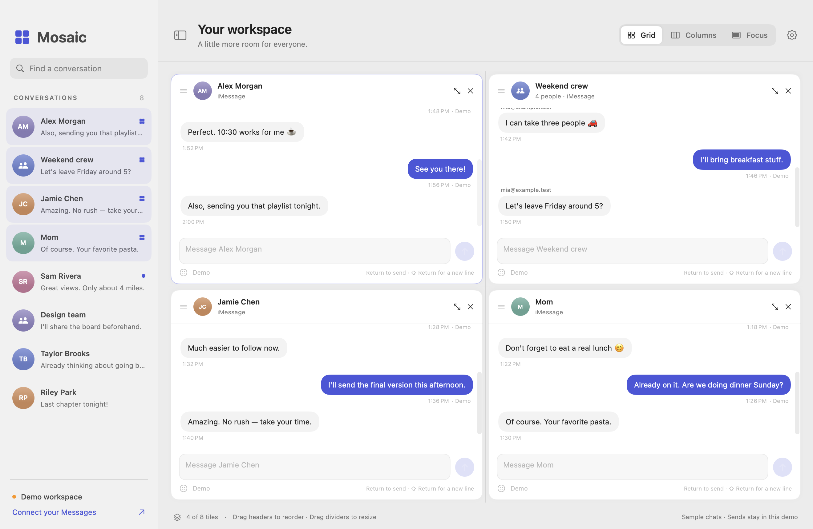

# Mosaic

A native macOS SwiftUI workspace for keeping several Messages conversations open in one window.



Open a conversation from the sidebar to give it a tile. Keep up to eight chats open, resize the dividers, drag a header onto another tile to reorder, and reply from each tile's own composer. Grid, Columns, and Focus layouts are available. Open tiles, layout mode, and independent drafts survive reopening the app; divider sizes are adjusted within the current session.

## Run

Requires macOS 14 or later and Xcode 16 / Swift 6 or later to build. No third-party dependencies or package installs.

```sh
git clone git@github.com:doctorschmoctor/Mosaic.git
cd Mosaic
./scripts/build-app.sh
open build/Mosaic.app
```

Or open **Mosaic.xcodeproj**, select the **Mosaic** scheme, and press Run. The project defaults to local ad-hoc signing; no paid developer account is required. SwiftPM is also supported through `Package.swift`. Use the packaged `.app` for Messages permissions because it contains the privacy descriptions and automation entitlement.

The app starts with fictional demo conversations. Sending in demo mode adds a local bubble only. To force a fresh demo without touching your saved workspaces:

```sh
open build/Mosaic.app --args --demo
```

## Connect real conversations

1. Open **Connect your Messages** in the sidebar.
2. Open **Full Disk Access**, add the built `Mosaic.app`, enable it, then quit and reopen Mosaic. The **Show Mosaic in Finder** button reveals the exact app to add. Grant access to the same app copy you will run regularly.
3. Click **Connect Messages**. Mosaic reads conversations already synced to Apple Messages on this Mac and refreshes every three seconds.
4. Send a text from a tile. macOS asks to let Mosaic control Messages; allow it. If denied, enable **Mosaic → Messages** in **Privacy & Security → Automation**. Failed submissions retain the draft.
5. Optionally click **Load contact names** to resolve addresses using Contacts. Names are kept in memory for the session and must be loaded again after relaunch.

Apple Messages must already be signed in. SMS/RCS availability depends on your existing Mac/iPhone Messages setup and the transport Apple exposes to automation. Mosaic never requests your Apple ID password.

## Workspace controls

- Click a sidebar conversation to add it or focus an existing tile.
- Drag a tile header onto another tile to place it before that tile.
- Drag native split dividers to resize. Large grids scroll vertically; Columns scroll horizontally when they exceed the window width.
- Close a tile with ×; its draft remains available when reopened.
- **Return** sends from the active composer; **Shift–Return** inserts a line break.
- **⌘K** focuses search; **⌘R** refreshes.
- **⌘⌥1**, **⌘⌥2**, **⌘⌥3** switch Grid, Columns, and Focus.
- **⌘⇧W** closes the focused tile.

## Current scope and limitations

This is a first working implementation for **existing conversations and text replies**, not a full replacement for every Messages feature. Apple provides no general Messages history API. Mosaic reads the local `~/Library/Messages/chat.db` with a **read-only SQLite connection**, including its live WAL, and submits sends through Messages' AppleScript dictionary. No private Apple frameworks are linked.

- The sidebar loads the 500 most recent conversations plus any open conversations. Search covers their names, participants, and latest previews.
- Each open tile initially loads 100 messages; **Load earlier messages** increases this up to 1,000.
- Plain text and common legacy typedstream bodies are displayed. Unknown rich-body formats are labeled with an **Open in Messages** fallback. Edits, unsends, rich formatting, tapbacks, and attachments are not fully rendered.
- Use Apple Messages for attachments, reactions, calls, new recipients, or group creation. **Open Messages** opens the direct recipient when available; for groups, it opens the app and you select the group there.
- “Submitted to Messages” means automation accepted the send, not delivery. Delivery/read status is shown only when reported by the database. Sends are never retried automatically.
- Mosaic does not write read flags to Apple's database or synchronize unread state. Its new-activity indicators are local to the running session.
- The integration depends on Apple's undocumented database schema and may need updates after a macOS release. Live reading/sending needs validation on your own Messages account after granting permissions.
- The local build is ad-hoc signed, not notarized or intended for App Store submission. For distributing to other Macs, use your own Developer ID and notarization. Rebuilding or moving an ad-hoc signed app may require renewing its permissions.

## Privacy

Message history and contact names remain in memory. Mosaic persists only workspace metadata and drafts in local UserDefaults (drafts are plaintext local app data). Demo and live workspaces are separate. There is no analytics, cloud backend, credential collection, or upload code. The repository contains only source, original icon artwork, tests with synthetic data, and a demo screenshot.

## Development

```sh
./scripts/test.sh
./scripts/build-app.sh
```

The core test suite covers independent drafts and restoration, tile capacity and ordering, read-only history isolation, WAL visibility, pinned conversations outside the recent limit, date formats, Unicode, long typedstream messages, malformed bodies, and permission errors. CI runs the tests and builds the app on macOS.

Composer tests also verify per-editor Return routing, Shift–Return line breaks, isolated demo sends, and compilation of the Messages automation script without executing it. `./scripts/render-preview.sh` renders the native view using fictional data for visual inspection.

`Sources/Mosaic` contains the UI, workspace state, Contacts integration, and exact-chat AppleScript sender. `Sources/MosaicCore` contains models and the read-only database reader. `Sources/CSQLite` exposes the system SQLite library. The Xcode target compiles the same sources directly; SwiftPM keeps the core separate for tests.

After adding source files, regenerate the Xcode project with `python3 scripts/generate-xcode-project.py`. To regenerate the original icon, run `swift scripts/make-icon.swift` followed by `iconutil -c icns .build/Mosaic.iconset -o Resources/Mosaic.icns`.

Apple references: [NSAppleScript](https://developer.apple.com/documentation/foundation/nsapplescript), [automation privacy description](https://developer.apple.com/documentation/bundleresources/information-property-list/nsappleeventsusagedescription), [macOS file access protections](https://support.apple.com/guide/security/controlling-app-access-to-files-secddd1d86a6/web).
